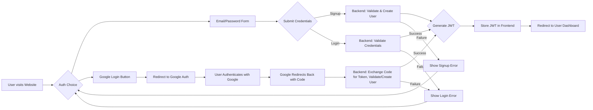
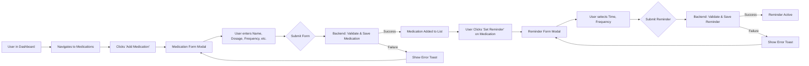
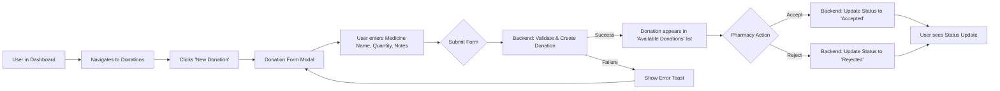
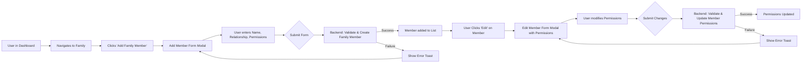

# PharmaCare+ Medication Management System

PharmaCare+ is a comprehensive medication management system designed to help users track their medications, set reminders, donate unused medications, manage family members' medications, and earn rewards for medication adherence.

## Table of Contents

- [Features](#features)
- [Technology Stack](#technology-stack)
- [Key Functionality Flowcharts](#key-functionality-flowcharts)
- [Project Structure](#project-structure)
- [Prerequisites](#prerequisites)
- [Setup Instructions](#setup-instructions)
- [Google OAuth2 Setup](#google-oauth2-setup)
- [API Documentation](#api-documentation)
- [User Roles](#user-roles)
- [Contributing](#contributing)
- [License](#license)
- [Contact](#contact)

## Features

- **Medication Management**: Add, edit, and delete medications with detailed information (dosage, frequency, schedule).
- **Reminder System**: Set up customizable reminders for medication doses with notifications.
- **Donation System**: Users can offer unused, unexpired medications for donation; Pharmacies can manage received donations.
- **Family Management**: Add family members, assign permissions to view/manage medications and reminders.
- **Analytics Dashboard**: Users view their adherence statistics and trends; Pharmacies view donation statistics.
- **Rewards System**: Earn points and achievements for medication adherence and other positive actions.
- **User Authentication**: Secure signup and login using email/password or Google OAuth2.
- **Pharmacy Portal**: Separate interface for pharmacies to manage donations.

## Technology Stack

**Frontend:**
- **Framework**: React (Vite)
- **Language**: TypeScript
- **Styling**: Tailwind CSS
- **State Management**: React Context API
- **Routing**: React Router
- **UI Components**: Shadcn/UI (likely, based on components used), Lucide Icons
- **Notifications**: React Hot Toast
- **Date Management**: date-fns

**Backend:**
- **Framework**: Spring Boot 3
- **Language**: Java 17
- **Database**: PostgreSQL 8.0
- **Authentication**: Spring Security, JWT (JSON Web Tokens), OAuth2 (Google)
- **API Documentation**: Swagger/OpenAPI
- **Build Tool**: Maven

**Database:**
- PostgreSQL 8.0

## Key Functionality Flowcharts

### 1. User Authentication (Signup/Login)



### 2. Add Medication & Set Reminder



### 3. Donate Medication (User)



### 4. Manage Family Members



## Project Structure

```
pharmacare-plus/
├── Backend/
│   ├── src/
│   ├── pom.xml
│   └── README.md
├── Frontend/
│   ├── public/
│   ├── src/
│   │   ├── assets/
│   │   ├── components/
│   │   ├── context/
│   │   ├── hooks/
│   │   ├── pages/
│   │   ├── services/
│   │   ├── styles/
│   │   ├── utils/
│   │   ├── App.tsx
│   │   ├── main.tsx
│   │   └── ...
│   ├── index.html
│   ├── package.json
│   ├── tsconfig.json
│   ├── vite.config.ts
│   └── README.md
├── .gitignore
├── LICENSE
└── README.md  (Root README - You are here)
```

## Prerequisites

- Java 17 or higher
- Node.js 16 or higher
- npm or yarn
- PostgreSQL 8.0 or higher

## Setup Instructions

### Backend Setup

1. Navigate to the Backend directory:
   ```sh
   cd Backend
   ```

2. Configure the database connection in `src/main/resources/application.properties` (or preferably in a separate, gitignored `src/main/resources/application-local.properties` file):
   ```properties
   spring.datasource.url=jdbc:postgresql://localhost:5432/pharmacare
   spring.datasource.username=your_db_username
   spring.datasource.password=your_db_password
   spring.datasource.driver-class-name=org.postgresql.Driver
   spring.jpa.properties.hibernate.dialect=org.hibernate.dialect.PostgreSQLDialect
   ```

3. Configure JWT secret (can remain in `application.properties` or move to `-local`):
   ```properties
   jwt.secret=pharmacarePlusSecretKey2024SecureApplicationJwtTokenSigningKeyWithExtraSecurityPaddingToEnsureItIsLongEnough
   jwt.expiration=86400000
   jwt.refresh-expiration=604800000
   ```

4. Configure Google OAuth2 credentials and Email credentials. Provide these values either via **environment variables** (e.g., `GOOGLE_CLIENT_ID`, `GOOGLE_CLIENT_SECRET`, `EMAIL_USERNAME`, `EMAIL_PASSWORD`) or by creating a file named `src/main/resources/application-local.properties` (which is ignored by Git) with the following content:
   ```properties
   # In application-local.properties (DO NOT COMMIT THIS FILE)
   spring.security.oauth2.client.registration.google.client-id=YOUR_ACTUAL_GOOGLE_CLIENT_ID
   spring.security.oauth2.client.registration.google.client-secret=YOUR_ACTUAL_GOOGLE_CLIENT_SECRET
   spring.mail.username=your-actual-email@gmail.com
   spring.mail.password=your-actual-app-password
   ```
   The main `application.properties` file uses placeholders like `${GOOGLE_CLIENT_ID}` which will be automatically replaced by environment variables or values from `application-local.properties`.

5. Build the application:
   ```sh
   ./mvnw clean package
   ```

6. Run the application:
   ```sh
   ./mvnw spring-boot:run
   ```

### Frontend Setup

1. Navigate to the Frontend directory:
   ```sh
   cd ../Frontend
   ```

2. Install dependencies:
   ```sh
   npm install
   # or yarn install
   ```

3. Configure the API URL. Create a `.env` file in the `